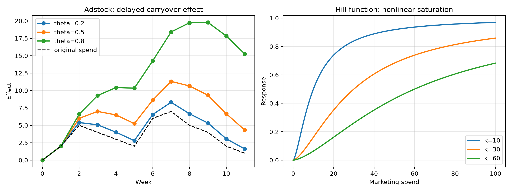

# MMM学習ノート

## 2-2. 非線形効果と 2-3. 遅延効果

広告の効果は、単純な線形ではなく、次のような性質を持ちます。

- 効果が途中から飽和する（非線形効果）
- 効果が翌週や翌月まで残る（遅延効果）

このイメージを図で見るとかなり理解しやすくなります。



### 1) 非線形効果: Hill 関数

広告投資を増やしても、ある程度までは大きく効きますが、さらに増やしても伸びが鈍くなることがあります。これは「飽和効果」です。

- 施策が少ないときは効果が伸びやすい
- ある水準を超えると増加率が落ちる
- 実務では「適度な投資量がある」のが重要

### 2) 遅延効果: adstock

広告効果がすぐに消えるわけではなく、今週の広告が来週にも影響を残すことがあります。

- θ が大きいほど効果が長く残る
- これは「持続する広告効果」として扱う
- 施策の評価では、1 週間分だけでなく複数週を見て判断する

### まとめ

MMMでは、次の 2 つをまとめて考えることが重要です。

- 効果は飽和する（Hill）
- 効果は残る（Adstock）

この 2 つをモデルに入れることで、現実のマーケティング効果をより自然に表現できます。

---

## Python で図を生成する例

```python
import numpy as np
import matplotlib
matplotlib.use('Agg')
import matplotlib.pyplot as plt


def adstock(x, theta=0.5):
    y = np.zeros(len(x), dtype=float)
    for t in range(len(x)):
        y[t] = x[t] + (theta * y[t - 1] if t > 0 else 0.0)
    return y


def hill(x, k=30, alpha=1.5):
    return (x ** alpha) / (k ** alpha + x ** alpha)

weeks = np.arange(12)
spend = np.array([0, 2, 5, 4, 3, 2, 6, 7, 5, 4, 2, 1], dtype=float)
fig, axes = plt.subplots(1, 2, figsize=(12, 4.5))

for theta in [0.2, 0.5, 0.8]:
    effect = adstock(spend, theta=theta)
    axes[0].plot(weeks, effect, marker='o', linewidth=2, label=f'theta={theta}')

axes[0].plot(weeks, spend, linestyle='--', color='black', linewidth=1.5, label='original spend')
axes[0].legend(loc='upper left')

marketing_spend = np.linspace(0, 100, 400)
for k in [10, 30, 60]:
    axes[1].plot(marketing_spend, hill(marketing_spend, k=k, alpha=1.5), linewidth=2, label=f'k={k}')

axes[1].legend(loc='lower right')
fig.tight_layout()
fig.savefig('docs/mmm_adstock_hill.png', dpi=200)
```
